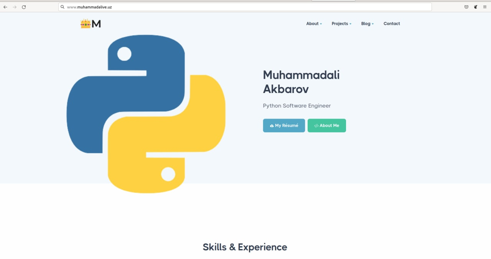

# About mysite project
My awesome web site<br>
Live website - https://www.muhammadali-live.uz/ <hr><br>


# Installation
* 1 - clone repo https://github.com/Muhammadali-Akbarov/mysite.git
* 2 - create a virtual environment and activate
*  - ```pip3 install virtualenv```
*  - ```virtualenv env``` or ```python -m venv env```
*  - ```env\Scripts\activate (windows)``` or ```source env/bin/activate (linux)```
* 3 -```cd into project "mysite"```
* 4 - set your .env file with using .env-sample
* 5 - ```pip install -r requirements.txt```
* 6 - ```python manage.py runserver```
* 7 - if you want to use docker ```sudo docker-compose up```


# Features
* You can easily find all information about me


# Completed with
* Django 
* Database Design and Models with Postgresql
* Deployment to heroku, digital ocean
* Docker and etc.


